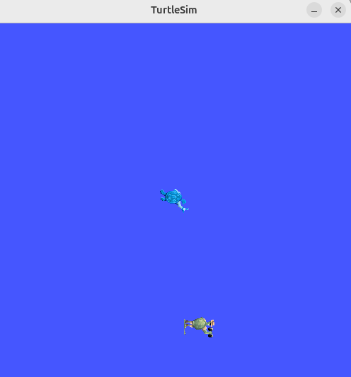

# turtle_scanner

## Partie 1
Le noeud spawn_target.py permet de creer une deuxieme tortue appelee turtle_target avec le service /spawn.
Les coordonnees sont generees aleatoirement entre 1 et 10 pour x et y.
Apres le spawn, les coordonnees de la cible sont affichees dans le terminal.

### Screenshot

## Partie 2
Le noeud turtle_scanner_node.py récupère la pose de turtle1 et de turtle_target avec les topics turtle1/pose et /turtle_target/pose.
Les poses sont stockées dans self.pose_scanner et self.pose_target.

Verification :
ros2 topic echo /turtle1/pose
ros2 topic echo /turtle_target/pose

## Partie 3
Les valeurs choisies pour la commande sont Kp_ang = 4.0 et Kp_lin = 1.5.
Avec Kp_ang = 2.0, la tortue tourne plus lentement vers le waypoint.
Avec Kp_ang = 6.0, la tortue tourne plus vite et le mouvement devient plus brusque.
Avec Kp_lin = 0.8, la tortue avance plus lentement.
Avec Kp_lin = 3.0, la tortue avance plus vite et peut depasser le waypoint.

